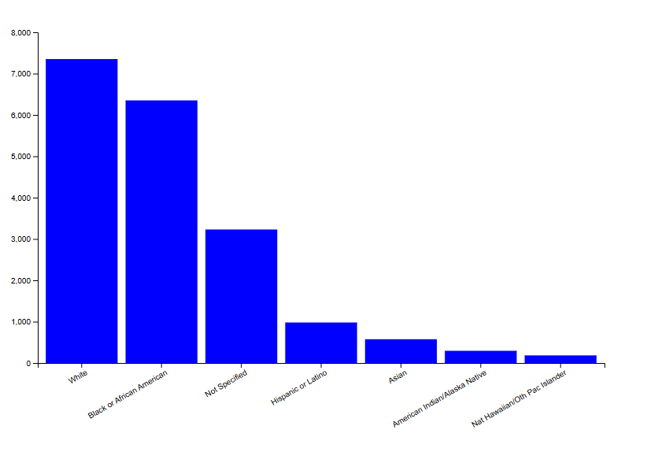

## Use of Force Incidents by Race

### Description
This bar chart visualizes Seattle Police Department total use of force incidents broken down by race. Each bar represents a racial/ethnic group and its height corresponds to the total number of incidents recorded.    
 
### Visual

 
### Data Source
Seattle Open Data Portal: Seattle Police Department Use of Force Dataset  
[https://data.seattle.gov/Public-Safety/Use-Of-Force/ppi5-g2bj](https://data.seattle.gov/Public-Safety/Use-Of-Force/ppi5-g2bj)