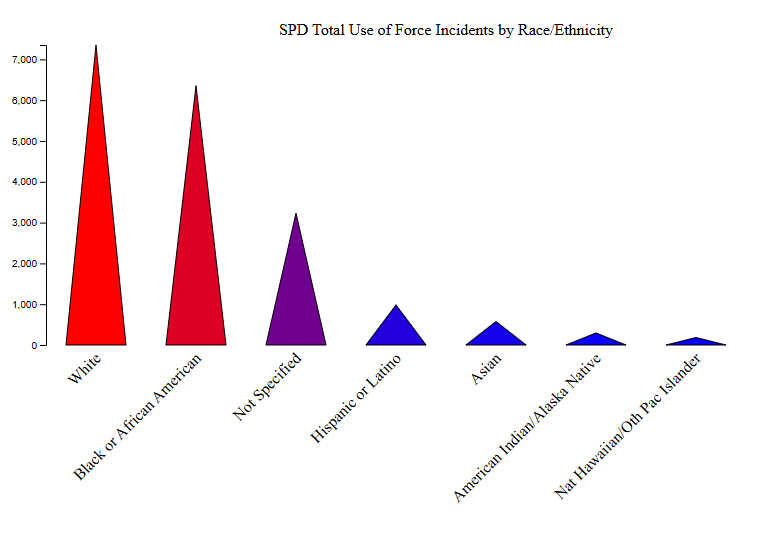

## Use of Force Incidents by Race

### Description
This visualization is meant to showcase SVG comprehension in D3 to display SPD total use of force incidents by race/ethnicity. Each triangle represents a race, with taller and redder triangles showing higher incident counts and shorter and bluer triangles indicating lower counts.

### Visual

### Data Source
Seattle Open Data Portal: Seattle Police Department Use of Force Dataset  
[https://data.seattle.gov/Public-Safety/Use-Of-Force/ppi5-g2bj](https://data.seattle.gov/Public-Safety/Use-Of-Force/ppi5-g2bj)