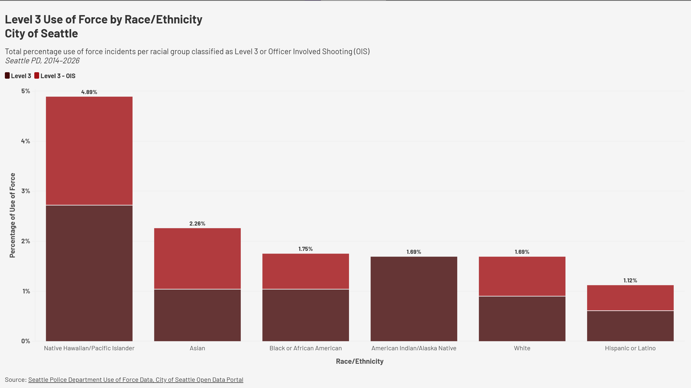

# Flourish1 – Seattle Use of Force Visualization

This visualization shows the percentage of level 3 use-of-force incidents recorded by the Seattle Police Department, broken down by race and ethnicity. I've chosen to focus on the most serious use-of-force incidents: Level 3 and Officer-Involved 
Shootings (OIS). This is to see if potential disparities show up when using the most severe force against different race groups. 

The data covers incidents from 2014 through 2026 and contains 18,999 records across four force levels (Level 1, Level 2, Level 3, and Level 3 - OIS).

**Data Source:** Seattle Police Department Use of Force Dataset  
City of Seattle Open Data Portal  
https://data.seattle.gov/Public-Safety/Use-Of-Force/ppi5-g2bj

[View on Flourish](https://public.flourish.studio/visualisation/28548099/)

