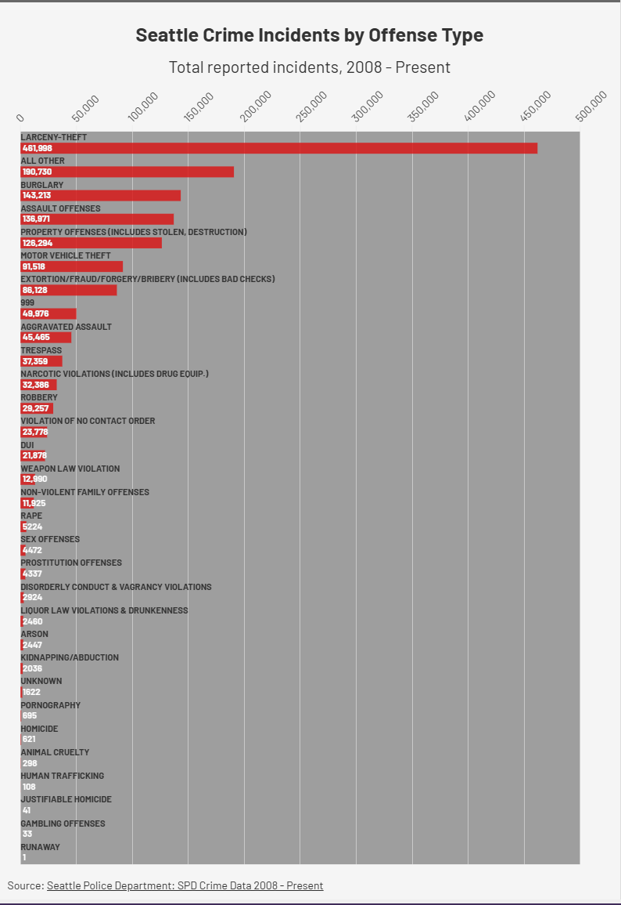

# Flourish2 – SPD Crime Data: 2008-Present Visualization

This horizontal bar chart visualizes the total number of reported crime incidents in Seattle by offense type, spanning from 2008 to the present. Each bar represents a distinct crime category, ranked in descending order by incident count, making it easy to identify which offense types are most and least prevalent across the city's recorded history. 

**Data Source:** SPD Crime Data: 2008-Present 
City of Seattle Open Data Portal  
https://data.seattle.gov/d/tazs-3rd5

[View on Flourish](https://public.flourish.studio/visualisation/28657975/)

## Citations

Seattle Police Department. (2026). Use of Force [Dataset]. 
City of Seattle Open Data Portal. 
https://data.seattle.gov/Public-Safety/Use-Of-Force/ppi5-g2bj
