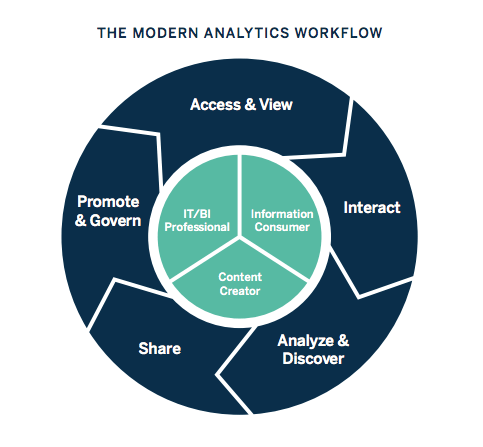

# uwb-public-data-26

# Introduction
Hi, my name is Manav Lakhani. I am graduating with a BS in Data Visualization and a minor in Data Analytics in Spring of 2026.  Personally I love this degree because of the potential career paths I can take, as I love working with data to tell stories and create predictions.

# Experience
I have a lot of experience working with the tools in this field. Tableau and R/R Studio are used a lot in my courses, and I learned and used Power BI to work for my dad's company doing business intelligence analytics. I also have some experience working with Git and Python, and will soon gain more.

*Figure sourced from: [Tableau](https://www.tableau.com/business-intelligence/what-is-business-intelligence)*

